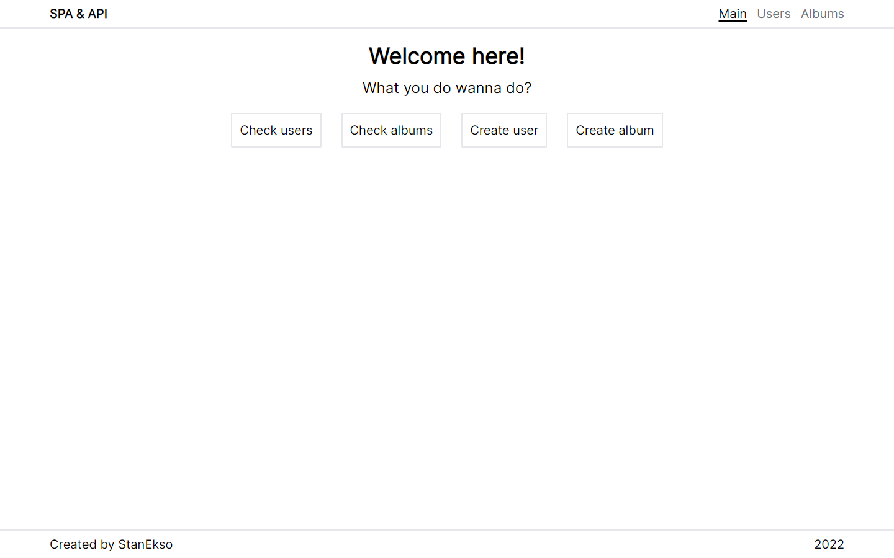
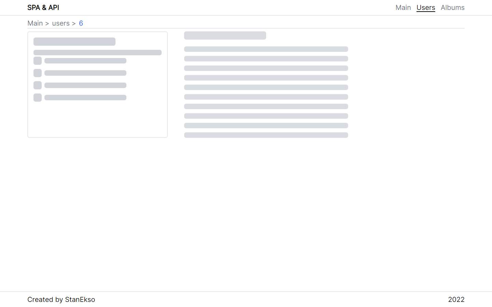

# React SPA & API

This project is example of "multi-page SPA" using React-Router.

Visit http://spa-lemon.vercel.app/ to checkout it by yourself.

## Preview on Desktop

## Technologies

- React
- React Hooks (and custom hooks)
- Typescript
- TailWind for styling
- React Router DOM for routing
- https://jsonplaceholder.typicode.com as fake REST API.

## Project Features

- Few Pages:
  - Main Page with links to other
  - Users Page
  - Album Page
- Page for every user/album and cross-links.
- Skeletons for best UX:
  - For lists: f.e. album list, user list and etc.
  - For cards: f.e. user card, photo card
  - Etc
- App is works fine for many devices (320px-1920px)

## Local install

### Pre-requirements:

- Node and NPM installed on your device

### Installation

- Clone this repository
- Run `npm install` in cloned folder
- Run `npm start` or `npm start` to start project locally
